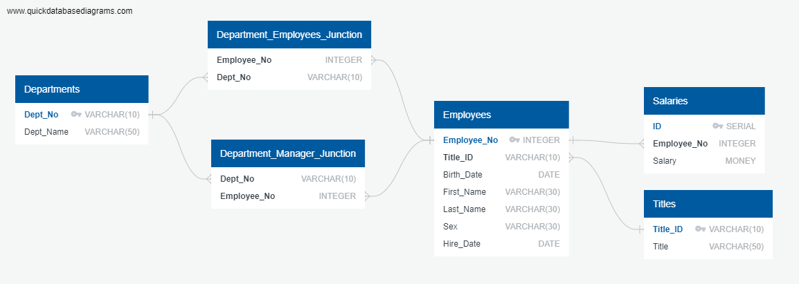

# SQL Challenge

This project is being completed for the University of Minnesota Data Analytics and Visualization Boot Camp.

## Background

It’s been two weeks since you were hired as a new data engineer at Pewlett Hackard (a fictional company). Your first major task is to do a research project about people whom the company employed during the 1980s and 1990s. All that remains of the employee database from that period are six CSV files.

For this project, you’ll design the tables to hold the data from the CSV files, import the CSV files into a SQL database, and then answer questions about the data. That is, you’ll perform data modeling, data engineering, and data analysis, respectively.

## Data Modeling

Step one in this assignment was to sketch an Entity Relationship Diagram (ERD) using QuickDBD.

## Data Engineering

Next, a table schema needed to be created for each of the six CSV files for this project. Each table needed to have column data types specified, primary keys and foreign keys set, and other constraints as necessary. Then, each CSV could be imported into its corresponding SQL table. Please see Table_Schema.sql for the table schema.

## Data Analysis

The assignment asked for the following queries to be completed:
1) List the employee number, last name, first name, sex, and salary of each employee.
2) List the first name, last name, and hire date for the employees who were hired in 1986.
3) List the manager of each department along with their department number, department name, employee number, last name, and first name.
4) List the department number for each employee along with that employee’s employee number, last name, first name, and department name.
5) List first name, last name, and sex of each employee whose first name is Hercules and whose last name begins with the letter B.
6) List each employee in the Sales department, including their employee number, last name, and first name.
7) List each employee in the Sales and Development departments, including their employee number, last name, first name, and department name.
8) List the frequency counts, in descending order, of all the employee last names (that is, how many employees share each last name).

See Queries.sql for the full list of queries written in SQL.